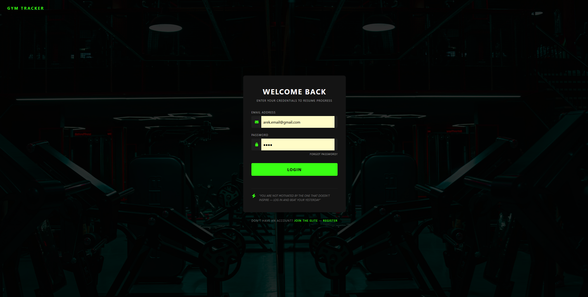
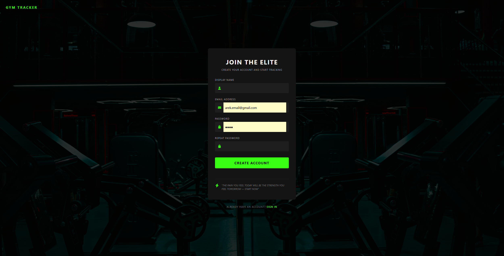
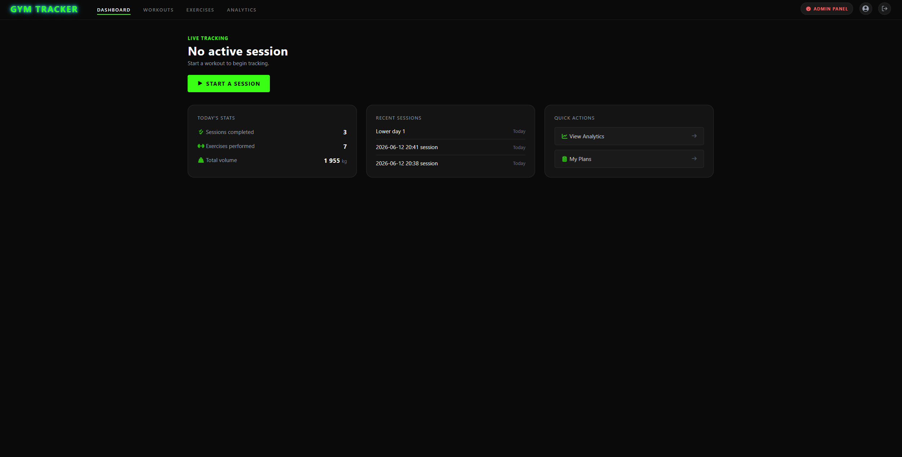
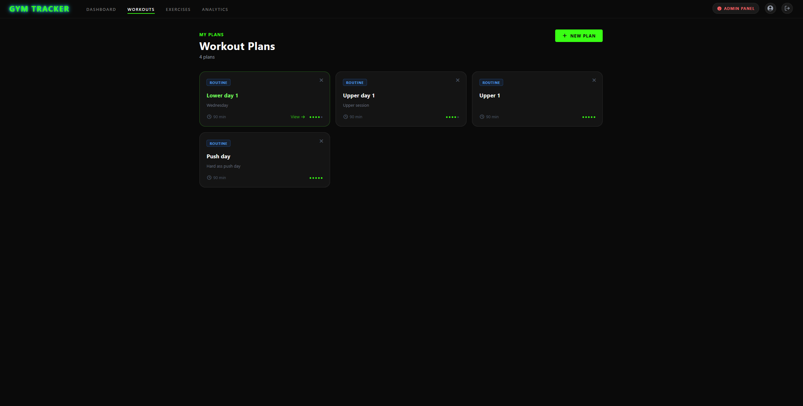
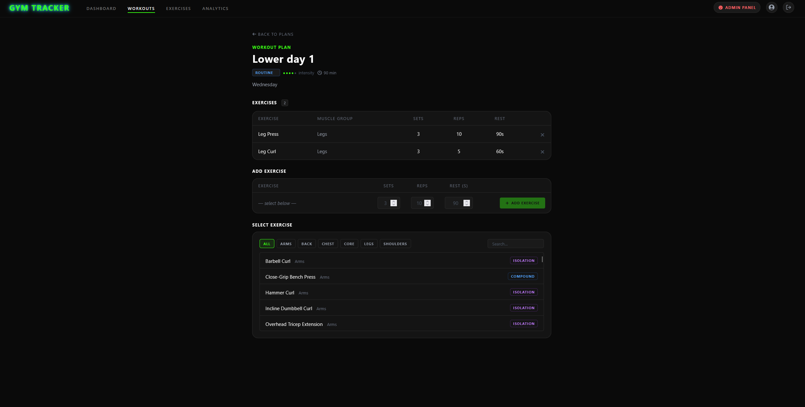
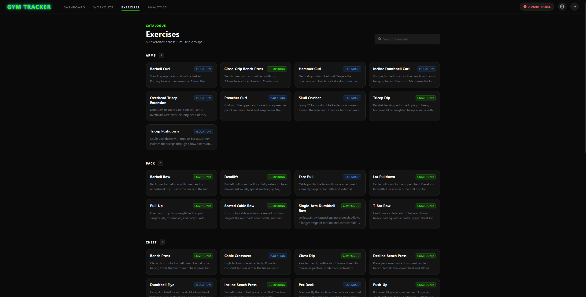
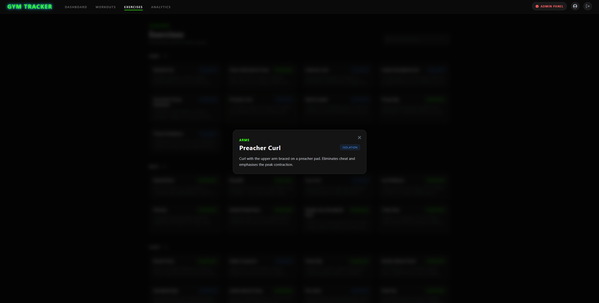
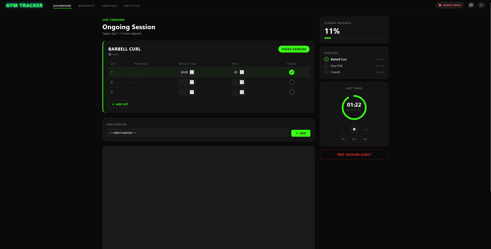
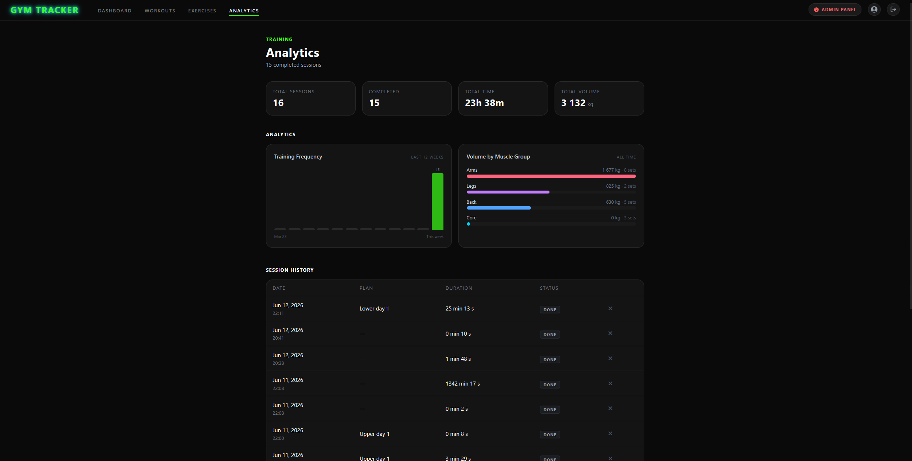
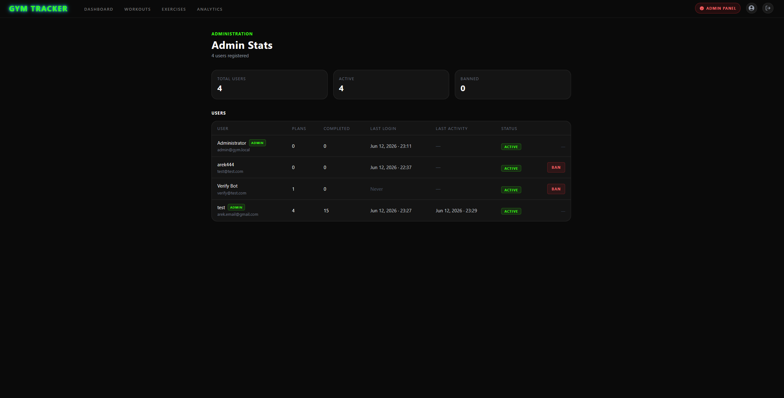

# GymTracker

A web app for planning and tracking gym workouts. You build your own plans, run a workout
"live" (logging your sets and timing your rest breaks), and then look back at your stats and progress.

---

## What the app can do

- **Account & sign-in** – register, log in, and log out. A blocked account can't get in.
- **Workout plans** – create plans, give them a status (draft / routine / active / archived),
  and add or remove exercises with their sets, reps, and rest time.
- **Exercise catalogue** – a ready-made list of 50 exercises grouped by muscle, with a search box.
  Clicking an exercise shows its full description in a pop-up in the middle of the screen.
- **Live workout** – start a session (from a plan or from scratch), tick off completed sets,
  enter weight and reps, and once a set is marked done a **rest timer** kicks in — and it keeps
  running correctly even when you switch between pages.
- **Analytics** – a summary of your training, a frequency chart for the last 12 weeks,
  a breakdown of volume per muscle group, and a history of finished sessions.
- **Admin panel** – a separate view for the administrator: a list of all accounts,
  their activity, and the ability to block or unblock users.

---

## Screenshots

A walk-through of the app, in the order you'd use it.

**Sign in / register**




**Dashboard** — today's stats, recent sessions, and quick links



**Workout plans** — your plans, and a plan's details with its exercises, status, and exercise picker




**Exercise catalogue** — grouped by muscle with a search box; click an exercise for the full description




**Live workout** — log your sets and time your rest breaks



**Analytics** — frequency chart, volume per muscle group, and session history



---

## What you need

All you need to run it is **Docker** (for example Docker Desktop). You don't have to install
PHP or a database yourself — everything runs in ready-made containers.

The app uses ports **8080**, **5050**, and **5433** — make sure they're free.

---

## How to run it

1. **Download the project** to your computer.

2. **Create a `.env` file** in the project's main folder and paste this into it:

   ```
   DB_USERNAME=docker
   DB_PASSWORD=docker
   DB_HOST=db
   DB_DATABASE=db
   ```

3. **Start the app** from the project's main folder:

   ```
   docker compose up -d
   ```

   (on older Docker versions use `docker-compose up -d`)

   On the first run the database sets itself up and fills in the exercise list —
   there's nothing extra to import.

4. **Open it in your browser:** [http://localhost:8080](http://localhost:8080)

5. **Create an account** and log in.

### Stopping the app

```
docker compose down
```

---

## Where to find things

| What | Address | Login |
|------|---------|-------|
| The app | http://localhost:8080 | Your registered account |
| Database viewer (pgAdmin) | http://localhost:5050 | `admin@example.com` / `admin` |
| Database (direct) | `localhost:5433` | `docker` / `docker` |

---

## How to use it (step by step)

1. **Register** and log in.
2. On the **dashboard** you'll see today's stats, recent sessions, and quick links.
3. Go to **Workouts** and create a training plan.
4. Open the plan and **add exercises** to it (with sets, reps, and rest time).
5. Go back to the dashboard and **start a session** (based on a plan, or without one).
6. During the workout, tick off completed sets and enter weight and reps.
   Marking a set done starts the **rest timer**.
7. When you're finished, **end the session**.
8. Open **Analytics** to see your charts and training history.

---

## Administrator account

The administrator sees an extra **admin panel** (the button only appears in the navigation for them)
and can block or unblock user accounts.



A default administrator account is created automatically on the first run:

- **Email:** `admin@gym.local`
- **Password:** `admin12345`

Every account you register yourself is a regular user. To turn another account into an administrator,
change its role to `admin` in the database (for example through pgAdmin):

```sql
UPDATE users SET role = 'admin' WHERE email = 'your-email@example.com';
```

After logging in again, that account will have access to the admin panel.

---

## How it's put together (in short)

The project is split so that each part has one job:

- **`public/`** – what the user sees: pages (views), styles, and browser scripts.
- **`src/controllers/`** – the logic that handles requests (what happens when you click or submit a form).
- **`src/repositories/`** – talking to the database (reading and saving data).
- **`src/entity/`** – how data is represented in the code (for example, a user).
- **`docker/`** – the container setup (web server, PHP, database, pgAdmin).
- **`docker/db/init/init.sql`** – the full database structure and starter data.

---

## For people developing the project

The look is built with **Tailwind**. The ready-to-use styles are already included in the project
(`public/styles/tailwind.css`), so you only need the steps below if you actually change how the
pages look. The Tailwind tool itself (`tailwindcss.exe`) stays on your machine and is not part of the repo.

If you change the styles in the pages, rebuild the CSS file with one command (Windows):

```
.\tailwindcss.exe -i .\src\tailwind.css -o .\public\styles\tailwind.css --minify
```

or in continuous mode (rebuilds automatically when something changes):

```
.\tailwindcss.exe -i .\src\tailwind.css -o .\public\styles\tailwind.css --watch
```
